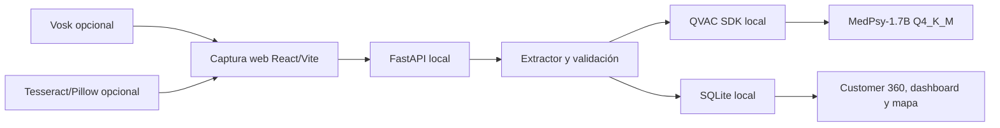

# Installed Base Intelligence

Aplicación local para transformar observaciones de campo sobre equipos hospitalarios en evidencia estructurada, revisable y útil para construir una vista de base instalada por hospital.

El flujo es completo: **capturar → extraer → revisar → comparar → guardar → visualizar → identificar oportunidades**. La extracción central usa MedPsy local con QVAC; SQLite conserva los registros finalizados y el usuario decide coincidencias o conflictos antes de consolidar activos.

> Esta herramienta organiza información de inventario. No diagnostica, no recomienda tratamiento, no certifica el estado clínico de un equipo y no sustituye una inspección técnica. Todo resultado de IA requiere revisión humana.

## Contenido

**Preparación de la demo y resultados reales:** [reporte de verificación](benchmarks/FINAL_READINESS.md).
El aprendizaje futuro consiste en conservar localmente la observación, la propuesta
de MedPsy y la revisión humana. No hay entrenamiento durante las visitas ni un LoRA
activado. El modelo actual sigue siendo MedPsy base.

Al finalizar una visita revisada, `training_feedback` guarda un paquete pendiente
de revisión, sin audio ni credenciales. Para exportarlo desde la raíz:

```powershell
.\backend\.venv\Scripts\python.exe backend/scripts/export_training_feedback.py --output feedback-para-revisar.jsonl
```

Este archivo puede contener observaciones reales: mantenerlo local, fuera de Git.
Revisar y anonimizar los textos, convertir las correcciones al esquema de extracción
y separar futuros splits antes de un entrenamiento offline explícito. Guardar feedback
no cambia por sí solo el comportamiento del modelo.

En el equipo Intel i3/Intel UHD comprobado, iniciar QVAC con `$env:QVAC_DEVICE='cpu'`.
`MODEL_MODE=base` fuerza el modelo base. `MODEL_MODE=lora` requiere una ruta
`QVAC_LORA_PATH` y un adaptador evaluado; los checkpoints experimentales no son aptos.

- [Qué resuelve](#qué-resuelve)
- [Arquitectura local](#arquitectura-local)
- [Requisitos](#requisitos)
- [Instalación desde cero](#instalación-desde-cero)
- [Ejecutar la aplicación](#ejecutar-la-aplicación)
- [Tutorial de uso](#tutorial-de-uso)
- [Funciones](#funciones)
- [Voz y fotografías](#voz-y-fotografías)
- [Datos, privacidad y red](#datos-privacidad-y-red)
- [Pruebas y rendimiento](#pruebas-y-rendimiento)
- [API local](#api-local)
- [Solución de problemas](#solución-de-problemas)
- [Entrega Track 02](#entrega-track-02)

## Qué resuelve

Un colaborador de campo puede escribir o dictar una observación como:

```text
Dos resonadores Siemens y un tomógrafo Philips de siete años.
```

MedPsy propone una estructura con modalidad, fabricante, modelo, configuración, edad y condición solamente cuando esos datos aparecen en el texto. La persona revisa la evidencia, confirma una coincidencia o un equipo nuevo, y finaliza la visita. La aplicación actualiza las vistas por hospital, región, modalidad, antigüedad y oportunidad.

La aplicación diferencia entre:

- **Evidencia:** lo observado en una visita concreta, con su nota original y trazabilidad.
- **Activo canónico:** equipo consolidado del hospital, vinculado a una o más evidencias tras una decisión humana.
- **Confiabilidad:** cálculo determinista basado en completitud, revisión, frescura, corroboración y conflictos. No es una probabilidad generada por IA.

## Arquitectura local



El flujo principal de IA usa exclusivamente `@qvac/sdk` y el modelo oficial `HEALTHCARE_1_7B_MEDICAL_Q4_K_M` de MedPsy. QVAC escucha en `127.0.0.1:11500`; FastAPI se comunica con esa dirección local. No hay inferencia en la nube ni RAG implementado.

| Componente       | Puerto  | Propósito |
| --- | ---: | --- |
| QVAC / MedPsy    | 11500   | Inferencia local mediante `@qvac/sdk` |
| FastAPI          | 8000    | API, SQLite, extracción y validación |
| Vite             | 5173    | Interfaz web local |
| SQLite           | archivo | `backend/data/inventory.sqlite3` |

## Requisitos

La configuración de referencia y el benchmark incluido se ejecutaron en:

| Recurso | Especificación registrada |
| ---     | --- |
| Sistema | Windows 11 Home, 64 bits |
| Equipo  | Lenovo 82Y3 |
| CPU     | Intel Core i9-13900H, 14 núcleos / 20 hilos |
| GPU     | NVIDIA GeForce RTX 4070 Laptop GPU |
| RAM     | 32 GB |
| Node.js | 24.20.0 |
| Python  | 3.14.7 |

El detalle reproducible de la máquina se genera en `benchmarks/results/hardware.json`. MedPsy Q4 está diseñado para hardware de consumo; el rendimiento variará según CPU, GPU, memoria, drivers y configuración del SDK.

Necesitas:

- Windows 10/11, PowerShell y Git.
- Node.js 24 o una versión compatible con la versión fijada en `package-lock.json`.
- Python 3.14 o compatible.
- Espacio para dependencias y los pesos MedPsy, aproximadamente 1.3 GB.
- Internet solo durante instalaciones o descargas explícitas. La aplicación puede usarse sin Internet una vez preparada.

Opcional:

- Micrófono y navegador con `getUserMedia` para dictado.
- Tesseract OCR para leer placas fotográficas.

## Instalación desde cero

Ejecuta los comandos desde la raíz del repositorio en PowerShell.

### 1. Clonar e instalar dependencias

```powershell
git clone <URL-DEL-REPOSITORIO>
cd Senacyt-Hackaton

npm.cmd ci
npm.cmd ci --prefix frontend

py -3.14 -m venv backend/.venv
.\backend\.venv\Scripts\python.exe -m pip install -r backend/requirements.txt
```

Si `py -3.14` no existe, usa la ruta de tu instalación de Python. El entorno virtual debe quedar en `backend/.venv`.

### 2. Descargar MedPsy explícitamente

```powershell
npm.cmd run qvac:download
```

Este comando descarga una vez los pesos oficiales de MedPsy desde Hugging Face y verifica tamaño y SHA-256. Los pesos van a `models/`, directorio ignorado por Git. El servidor no descarga modelos automáticamente.

Si ya tienes el mismo GGUF oficial en otra ubicación:

```powershell
$env:QVAC_MODEL_PATH = 'D:\modelos\medpsy-1.7b-q4_k_m-imat.gguf'
```

No uses otro modelo bajo ese nombre: el servicio valida la huella del peso oficial.

### 3. Opcional: dictado local

```powershell
.\backend\.venv\Scripts\python.exe -m pip install -r backend/requirements-stt.txt
.\backend\.venv\Scripts\python.exe backend/scripts/install_stt_model.py
```

Instala Vosk y el modelo local español `vosk-model-small-es-0.42`. La transcripción funciona en memoria, es editable y el audio no se guarda.

### 4. Opcional: OCR local de placas

Instala el ejecutable de Tesseract:

```powershell
winget install --id UB-Mannheim.TesseractOCR --exact --source winget
```

Instala Pillow y los archivos de idioma local inglés y español:

```powershell
.\backend\.venv\Scripts\python.exe -m pip install -r backend/requirements-stt.txt
.\backend\.venv\Scripts\python.exe backend/scripts/install_ocr_languages.py
```

El instalador guarda `eng.traineddata` y `spa.traineddata` en `models/tessdata/` con un manifiesto de hashes. No se invoca en el arranque. Si Tesseract está en una ruta no estándar, define antes de iniciar FastAPI:

```powershell
$env:TESSERACT_COMMAND = 'D:\ruta\a\tesseract.exe'
```

## Ejecutar la aplicación

Abre tres terminales en la raíz del repositorio.

**Terminal 1 — MedPsy local**

```powershell
npm.cmd run qvac:start
```

Espera el mensaje `QVAC SDK ready`. Solo debe haber una instancia cargando los pesos, para no duplicar el uso de memoria.

**Terminal 2 — API y SQLite**

```powershell
cd backend
.\.venv\Scripts\python.exe -m uvicorn app.main:app --host 127.0.0.1 --port 8000 --reload
```

**Terminal 3 — interfaz**

```powershell
cd frontend
npm.cmd run dev -- --port 5173 --strictPort
```

Abre [http://localhost:5173](http://localhost:5173). La documentación de la API queda en [http://127.0.0.1:8000/docs](http://127.0.0.1:8000/docs).

Para comprobar el estado local:

```powershell
Invoke-RestMethod http://127.0.0.1:11500/health
Invoke-RestMethod http://127.0.0.1:8000/status
Invoke-RestMethod http://127.0.0.1:8000/media/status
```

`/media/status` indicará `unavailable` para STT u OCR si no instalaste los componentes opcionales. La captura escrita con MedPsy sigue funcionando.

## Tutorial de uso

1. Regístrate o inicia sesión como colaborador.
2. En **Nueva visita**, busca y selecciona el hospital. Al seleccionar otro hospital, se descarta automáticamente el borrador de una visita pendiente; las visitas finalizadas no se borran.
3. Elige un área e inicia la captura.
4. Escribe una observación o usa el micrófono. Puedes adjuntar una placa PNG/JPEG y usar OCR local; revisa y confirma el texto antes de añadirlo a la nota.
5. Pulsa **Analizar con MedPsy local**. MedPsy propone los equipos y deja en blanco los atributos no mencionados.
6. En **Revisión**, corrige modalidad, marca, modelo, configuración, edad y estado. Responde hasta dos preguntas de seguimiento o marca el valor como desconocido.
7. En **Coincidencias**, decide para cada evidencia: vincular a un activo existente, crear uno nuevo o enviar a revisión. El sistema propone; la persona decide.
8. Finaliza la visita. Solo entonces se confirma el guardado en SQLite y se limpian los borradores.
9. Abre **Hospitales / Customer 360**, **Dashboard**, **Mapa**, **Oportunidades** o **Analytics** para consultar los datos terminados.

Ejemplo para probar:

```text
Durante la visita se observaron dos resonadores Siemens y un tomógrafo Philips de siete años. El tomógrafo sigue operativo, pero el modelo no pudo confirmarse.
```

Resultado esperado: dos equipos MRI Siemens sin edad explícita y un CT Philips con edad estimada de siete años. El modelo queda `null` porque no fue mencionado.

## Funciones

| Función | Comportamiento |
| --- | --- |
| Captura en lenguaje natural | Texto ES/EN/PT, con detección local conservadora de idioma. |
| Extracción MedPsy | Modalidad, marca, modelo, configuración, edad, condición y ubicación solo si aparecen explícitamente. |
| Validación | Reglas deterministas corrigen contradicciones explícitas de cantidad, marcas y ausencia de equipos; no inventan datos. |
| Preguntas de seguimiento | Prioriza cantidad y atributos faltantes; máximo dos preguntas para evitar fatiga. |
| Duplicados | Candidatos restringidos al mismo hospital y modalidad; la decisión es humana y auditable. |
| Confiabilidad | Completitud, revisión, frescura, corroboración y conflicto; no es confianza del modelo. |
| Frescura y oportunidades | Señales de información antigua, conflicto y equipos con edad mayor de siete años; no es recomendación clínica. |
| Customer 360 | Activos, evidencias, visitas, nota fuente, colaboradores, conflictos y auditoría por hospital. |
| Dashboard y mapa | Totales por hospital, región y modalidad; mapa local por coordenadas del catálogo, sin mosaicos remotos. |
| Analítica natural | MedPsy convierte una pregunta en filtros JSON validados; nunca genera SQL. |

## Voz y fotografías

### Voz

El botón **Comenzar a hablar** solicita permiso al micrófono. El navegador convierte la grabación a WAV mono de 16 kHz; Vosk la transcribe localmente y el usuario edita el texto antes de enviarlo a MedPsy. Máximo tres minutos por grabación.

### Fotografías

La captura acepta PNG y JPEG de hasta 2 MB. Tesseract y Pillow corrigen orientación, transparencia, contraste y escala antes de leer una placa. Se puede elegir:

- Placa con campos separados.
- Bloque de texto.
- Una línea o código.

El OCR identifica texto visible, por ejemplo marca, modelo y serie. No reconoce de manera fiable la condición operativa, antigüedad o tipo de un equipo solo por su apariencia. El resultado siempre es editable y requiere confirmación humana antes de pasar a MedPsy.

Más detalle y plan de evaluación: [PHOTO_ANALYSIS.md](PHOTO_ANALYSIS.md).

## Datos, privacidad y red

- SQLite local es la fuente de verdad para visitas finalizadas.
- Las observaciones, inventario, voz y fotografías no se envían a Internet durante el uso normal.
- El mapa funciona con coordenadas locales y no solicita cartografía, geocodificación ni mosaicos remotos.
- Las únicas conexiones externas son instalaciones explícitas de paquetes, pesos MedPsy, modelo Vosk o idiomas OCR.
- Los benchmarks guardan prompts **sintéticos** para reproducibilidad; las métricas operativas no guardan observaciones reales.
- No guardes contraseñas en texto plano ni compartas `backend/data/inventory.sqlite3` fuera de un contexto autorizado.

La relación completa de componentes, licencias y destinos de red está en [THIRD_PARTY_AND_PRIVACY.md](THIRD_PARTY_AND_PRIVACY.md). El código del repositorio está bajo [MIT](LICENSE).

### Base de datos y catálogo

Por defecto la base está en `backend/data/inventory.sqlite3`. Para usar otra ubicación:

```powershell
$env:APP_DATABASE_PATH = 'D:\datos\inventory.sqlite3'
```

El catálogo de Panamá procede del listado de instalaciones de salud 2024 de MINSA y conserva país, provincia, distrito, ciudad, dependencia, tipo y coordenadas aproximadas de localidad. No debe tratarse como padrón oficial definitivo ni como geocodificación clínica. Las visitas usan IDs de hospital reales, por ejemplo `HOSP-001`.

## Pruebas y rendimiento

### Pruebas de código

```powershell
npm.cmd test --prefix frontend
npm.cmd run build --prefix frontend
npm.cmd run lint --prefix frontend

cd backend
.\.venv\Scripts\python.exe -m unittest discover -s tests
```

Las pruebas usan SQLite temporal. Los scripts de seed sintético solo se ejecutan de forma explícita y no deben usarse contra la base de inventario real sin intención deliberada.

### Registro estructurado QVAC

Con QVAC iniciado:

```powershell
cd ..
npm.cmd run qvac:hardware
npm.cmd run qvac:benchmark
```

Los resultados quedan en:

- `benchmarks/results/hardware.json`: CPU, RAM, GPU, sistema, versiones y salud de MedPsy.
- `benchmarks/results/multilingual.json`: prompts sintéticos, salidas, tokens, TTFT, throughput, carga del modelo, dispositivo y resultado por caso.

La corrida incluida valida 15 casos sintéticos de inventario: cinco en español, cinco en inglés y cinco en portugués. Es una medición reproducible del alcance evaluado, no una garantía de precisión clínica o general.

## API local

Todos los endpoints se documentan interactivamente en `/docs`.

| Método | Ruta | Uso |
| --- | --- | --- |
| POST | `/observations/analyze` | Extrae equipos con MedPsy. |
| GET | `/status` | Estado de FastAPI, SQLite, QVAC, STT y OCR. |
| GET | `/hospitals` | Catálogo persistido. |
| GET | `/hospitals/{id}/overview` | Customer 360 de un hospital. |
| PUT | `/visits/{id}` | Guarda una visita finalizada y su evidencia. |
| GET | `/visits` | Lista visitas finalizadas. |
| POST | `/visits/similarity` | Busca visitas similares dentro del hospital. |
| POST | `/equipment/candidates` | Propone activos candidatos para decisión humana. |
| GET | `/dashboard` | Agregaciones de SQLite. |
| POST | `/analytics/query` | Convierte una pregunta a filtros seguros con MedPsy. |
| POST | `/media/transcribe` | Transcribe WAV local con Vosk, si está disponible. |
| POST | `/media/ocr` | Lee placa local con Tesseract, si está disponible. |

Ejemplo de análisis:

```powershell
$body = @{ hospital_id = 'HOSP-001'; text = 'Un CT Philips de siete años.' } | ConvertTo-Json
Invoke-RestMethod http://127.0.0.1:8000/observations/analyze -Method Post -ContentType 'application/json' -Body $body
```

## Solución de problemas

| Síntoma | Acción |
| --- | --- |
| `QVAC no devolvió una respuesta estructurada válida` | Confirma que `npm.cmd run qvac:start` esté activo y reduce la observación a una nota clara. La nota no se borra. |
| `No se pudo conectar con QVAC` | Consulta `http://127.0.0.1:11500/health`; verifica que el modelo oficial exista y tenga la huella correcta. |
| El frontend no guarda | Confirma que FastAPI está en el puerto 8000 y abre `/docs`. Los borradores permanecen en pantalla para reintentar. |
| El micrófono no inicia | Permite el permiso del navegador, usa HTTPS/localhost y verifica Vosk con `GET /media/status`. |
| OCR no disponible | Instala Tesseract, Pillow y ejecuta `install_ocr_languages.py`. Comprueba `GET /media/status`. |
| OCR lee mal la placa | Fotografía de cerca, enfocada, recta, sin brillo; prueba el modo de distribución adecuado y corrige el texto antes de confirmarlo. |
| El puerto está ocupado | Cierra la instancia anterior del proceso correspondiente o cambia el puerto de forma consistente en frontend y backend. |
| El mapa no muestra un hospital | Revisa filtros y confirma que el hospital tenga coordenadas en el catálogo; algunas ubicaciones son aproximadas a la ciudad. |

## Entrega Track 02

El paquete específico del concurso está en [TRACK02_SUBMISSION.md](TRACK02_SUBMISSION.md). Incluye la justificación del modelo Psy, evidencia de `@qvac/sdk`, hardware, benchmark, privacidad, licencia y un guion de vídeo de menos de cinco minutos.

Antes de presentar:

1. Ejecuta `npm.cmd run qvac:hardware` y `npm.cmd run qvac:benchmark` en la máquina que mostrarás.
2. Confirma que los archivos en `benchmarks/results/` reflejen esa máquina y corrida.
3. Graba el flujo completo sin Internet: captura, MedPsy, revisión humana, guardado, Customer 360 y dashboard.
4. Muestra claramente el nombre del modelo, cuantización, hardware, TTFT, throughput y límites médicos.
5. No afirmes una precisión fuera del conjunto sintético evaluado ni presentes una sugerencia de IA como confirmación técnica.

## Documentación relacionada

- [TRACK02_SUBMISSION.md](TRACK02_SUBMISSION.md): evidencia y guion de entrega QVAC Psy.
- [THIRD_PARTY_AND_PRIVACY.md](THIRD_PARTY_AND_PRIVACY.md): red, componentes y privacidad.
- [PHOTO_ANALYSIS.md](PHOTO_ANALYSIS.md): OCR fotográfico, límites y mejora futura.
- [TESTING.md](TESTING.md): casos de prueba manuales.
- [INTEGRATION_REPORT.md](INTEGRATION_REPORT.md): estado de integración y QA.
- [PHASE2_STATUS.md](PHASE2_STATUS.md): historial y alcance técnico.
